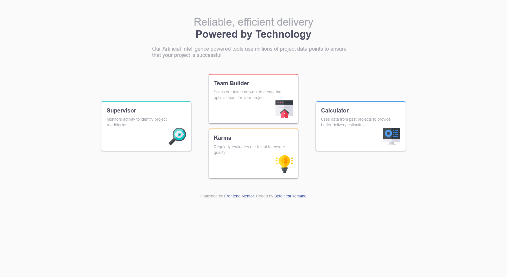

# Frontend Mentor - Four card feature section solution

This is a solution to the [Four card feature section challenge on Frontend Mentor](https://www.frontendmentor.io/challenges/four-card-feature-section-weK1eFYK). Frontend Mentor challenges help you improve your coding skills by building realistic projects. 

## Table of contents

- [Overview](#overview)
  - [The challenge](#the-challenge)
  - [Screenshot](#screenshot)
  - [Links](#links)
- [My process](#my-process)
  - [Built with](#built-with)
- [Author](#author)
- [Acknowledgments](#acknowledgments)

## Overview

### The challenge

Users should be able to:

- View the optimal layout for the site depending on their device's screen size

### Screenshot

### Links

- Solution URL: https://github.com/ManaIsrael/four-card-feature-section
- Live Site URL: 

## My process

### Built with

- Semantic HTML5 markup
- CSS custom properties
- Flexbox

## Author

- Frontend Mentor - [@manaisrael](https://www.frontendmentor.io/profile/manaisrael)
- Twitter - [@betelhemyemane3](https://www.twitter.com/betelhemyemane3)

## Acknowledgments

I Always Love to Acknowledge Mother of God Saint Virgin Mary, I wouldn't even know what my passion and luck is if I hadn't prayed unto her. Next I would Love to acknowledge my Mother Sara fekadu who encouraged me to keep up with my passion, without her advice, I wouldn't be here doing web development rather I would only just care about my GPAs.
